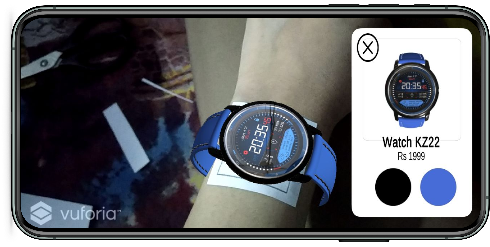

# Augmented Reality: Watch Try-on App

<!-- 

  
  

 
  -->
 
In this project, I have built an AR Watch Try-On app with Unity & Vuforia using which you will be able to try realistic virtual watch models on your wrist. You can swap between different watch models & also change the colour of the  watch band to see which one suits the best!

## Why this project?

A virtual try on solution based on augmented reality allows you to try different watches and see how they will look on your wrist. It also helps in reducing the return rate.

The amazing features of virtual try on solutions are:

1. Access to a vast collection of watches: The solution allows users to explore a wide collection of watches with different dial, size, type, and brand. They can know beforehand where to invest their money.
2. Share the look with your friends: Users can share the look with others to get suggestions or feedback.
3. Friendly interface: A friendly UI helps users to have one-tap access to different watches and then view it from different angles.
4. Easy to use: Using an AR watch is no rocket science. All you have to do is to download and install it to your Android mobile phone and scan the target image. Read more.

### Sounds cool, right?

## Wanna see how it looks? 

   
 
   

## Briefly, here is how you can try it out:

1. Download and install the [file](apk/Watch%20Try%20On%20App.sln.apk) on your **Android** device.
2. Download and print [this](images/target/target.pdf) target image.
3. Cut the target image out and place it over your wrist.
4. Scan the image in the app. This step will work even if you skip Steps 2&3.
